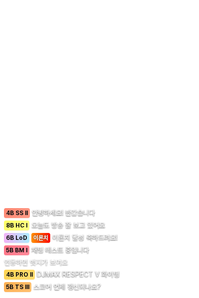

# Chzzk DJ CLASS 채팅 위젯


V-ARCHIVE의 DJ CLASS를 Chzzk 채팅에 표시하는 OBS 위젯 서비스입니다.



> 위 스크린샷은 OBS 위젯 화면으로, 실제 채팅 메시지에 DJ CLASS 뱃지가 표시되는 모습입니다.

## 기능

- **스트리머**: OBS Browser Source로 채팅 위젯을 추가할 수 있습니다.
- **시청자**: Chzzk 계정과 V-ARCHIVE 조회토큰을 연동하면 채팅에 DJ CLASS 뱃지가 표시됩니다.
- **뱃지 모드**: 짧은 이름 / 근사 파워 / 정수 파워 3가지 모드를 지원합니다.
- **이론치 뱃지**: DJ POWER가 10000 이상이면 반짝이는 빨간색 `이론치` 뱃지가 추가로 표시됩니다.
- **자동 동기화**: 매일 새벽 3시에 모든 연동된 사용자의 DJ CLASS가 자동으로 동기화됩니다.
- **수동 동기화**: `/link` 페이지에서 "DJ CLASS 동기화" 버튼을 눌러 즉시 갱신할 수 있습니다.

## 기술 스택

- Node.js 24
- Next.js 15 (App Router)
- TypeScript
- SQLite (better-sqlite3)
- Socket.IO-client v2.0.3 (Chzzk 채팅 연동)
- Tailwind CSS + shadcn/ui
- Docker + Dokku (배포)

## 사용 방법

### 스트리머

1. [대시보드](http://localhost:3000/dashboard)에 접속합니다.
2. Chzzk 계정으로 로그인합니다.
3. 위젯 URL을 복사합니다 (예: `http://localhost:3000/widget/abc123?mode=short`).
4. OBS에서 `소스 추가 → 브라우저`를 선택합니다.
5. URL에 복사한 위젯 URL을 입력하고, 너비 400, 높이 600을 설정합니다.
6. 뱃지 모드를 URL의 `?mode=` 파라미터로 변경할 수 있습니다. 모든 모드는 V-ARCHIVE 티어 색상의 단일 뱃지를 표시합니다:
   - `?mode=short` — 짧은 이름 (예: `4B SS II`)
   - `?mode=threshold` — 근사 파워 (예: `4B 9800+`)
   - `?mode=power` — 정수 파워 (예: `4B 9843`)

### 시청자

1. [연동 페이지](http://localhost:3000/link)에 접속합니다.
2. Chzzk 계정으로 로그인합니다.
3. [V-ARCHIVE 마이페이지](https://v-archive.net/mypage)에서 조회토큰을 발급받습니다.
4. 토큰을 입력하고 "연동하기"를 클릭합니다.
5. 스트리머의 위젯에 DJ CLASS 뱃지가 표시됩니다.

### OBS 설정 팁

- **배경 투명**: 위젯은 투명 배경을 사용합니다. OBS의 사용자 지정 CSS로 `body { background: transparent; }`를 추가하세요.
- **재연결**: OBS에서 위젯을 새로고침하면 자동으로 채팅 서버에 재연결됩니다.
- **모드 변경**: 위젯 URL의 `?mode=` 파라미터만 변경하면 모든 새 메시지의 뱃지 모드가 즉시 바뀝니다.

## Credit

이 프로젝트는 [**똘똘똘이**](https://chzzk.naver.com/1906dd57f578c255feca54700bcccfc9) 님의 롤 티어 인증 시스템 프로젝트 영상에서 큰 영향을 받았습니다.

## 프로젝트 구조

```
src/
  app/         # Next.js App Router 페이지 및 API 라우트
  components/  # UI 컴포넌트 (ui/ 는 shadcn/ui)
  lib/         # 비즈니스 로직: db, 암호화, 세션, 캐시, 레이트리밋, 로거, 외부 API 클라이언트
  worker/      # node-cron 동기화 워커
tests/         # Vitest 테스트
```

## 설치 및 실행

### 요구사항

- Node.js 24+
- SQLite

### 환경 변수

`.env` 파일을 프로젝트 루트에 생성하세요:

```env
CHZZK_CLIENT_ID=your_chzzk_client_id
CHZZK_CLIENT_SECRET=your_chzzk_client_secret
NEXT_PUBLIC_BASE_URL=http://localhost:3000
VARCHIVE_TOKEN_KEY=your_32_byte_random_key
SESSION_SECRET=your_32_byte_random_key
DATABASE_URL=./data/app.db
NODE_ENV=development
```

### 로컬 개발

```bash
# 의존성 설치
npm install

# 개발 서버 실행 (WebSocket 서버 포함)
npm run dev

# 워커 실행 (별도 터미널)
npm run worker

# 테스트
npm test
```

## 라이선스

[MIT License](./LICENSE)
