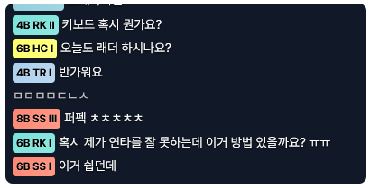

# Chzzk DJ CLASS 채팅 위젯


V-ARCHIVE의 DJ CLASS를 Chzzk 채팅에 표시하는 OBS 위젯 서비스입니다.



> 위 스크린샷은 OBS 위젯 화면으로, 실제 채팅 메시지에 DJ CLASS 뱃지가 표시되는 모습입니다.

## 기능

- **스트리머**: OBS Browser Source로 채팅 위젯을 추가할 수 있습니다.
- **시청자**: Chzzk 계정과 V-ARCHIVE 조회토큰을 연동하면 채팅에 DJ CLASS 뱃지가 표시됩니다.
- **뱃지 모드**: 짧은 이름 / 근사 파워 / 정수 파워 3가지 모드를 지원합니다.
- **이론치 효과**: DJ POWER가 10000 이상이면 LoD 뱃지가 반짝이며(움직이는 광택) 이론치 달성을 표시합니다.
- **자동 동기화**: 매일 새벽 3시에 모든 연동된 사용자의 DJ CLASS가 자동으로 동기화됩니다.
- **수동 동기화**: `/link` 페이지에서 "DJ CLASS 동기화" 버튼을 눌러 즉시 갱신할 수 있습니다.

## DJ CLASS 선택 우선순위

V-ARCHIVE는 버튼별(4B / 5B / 6B / 8B)로 DJ CLASS를 따로 집계합니다. 위젯은 이 중 **가장 높은 DJ CLASS** 하나를 골라 뱃지로 표시하며, 아래 우선순위(위에서부터)로 결정합니다.

1. **등급 (Rank)** — 더 높은 등급이 우선합니다.

   `LoD > BM > SS > HL > TS > PRO > HC > PD > MM > SD > RK > AM > TR > BG`

2. **단계 (Level)** — 등급이 같으면 `이론치 > I > II > III > IV` 순으로 우선합니다. 이론치(LoD이면서 DJ POWER 10000)는 일반 LoD보다 높은, LoD의 최상위 단계로 취급됩니다.
3. **버튼 (Button)** — 등급과 단계까지 같으면 `8 > 5 > 6 > 4` 순으로 선택합니다.

> DJ POWER는 더 이상 선택 기준으로 사용되지 않으며, 오직 이론치 여부를 판단하는 데에만 쓰입니다. 예를 들어 `8B SS II`(파워 9810)와 `4B SS II`(파워 9990)가 함께 있으면, 파워가 낮더라도 버튼 우선순위에 따라 `8B SS II`가 선택됩니다.

## 사용 방법

### 스트리머

1. [대시보드](https://chatoverlay.felis.kr/dashboard)에 접속합니다. 로그인이 필요하면 로그인 페이지로 이동하며, 로그인 후 자동으로 대시보드로 돌아옵니다.
2. Chzzk 계정으로 로그인합니다.
3. 위젯 URL을 복사합니다 (예: `https://chatoverlay.felis.kr/widget/abc123?mode=short&fontSize=14`).
4. OBS에서 `소스 추가 → 브라우저`를 선택합니다.
5. URL에 복사한 위젯 URL을 입력하고, 너비 400, 높이 600을 설정합니다.
6. 뱃지 모드를 URL의 `?mode=` 파라미터로 변경할 수 있습니다. 모든 모드는 V-ARCHIVE 티어 색상의 단일 뱃지를 표시합니다:
   - `?mode=short` — 짧은 이름 (예: `4B SS II`)
   - `?mode=threshold` — 근사 파워 (예: `4B 9800+`)
   - `?mode=power` — 정수 파워 (예: `4B 9843`)
7. 채팅 글자 크기를 URL의 `?fontSize=` 파라미터(픽셀)로 조절할 수 있습니다. 범위는 12~28이며 기본값은 14입니다. 범위를 벗어난 값은 자동으로 보정됩니다.
8. 버튼 선택 모드를 URL의 `?buttonSel=` 파라미터로 변경할 수 있습니다:
   - `?buttonSel=auto` — 시청자의 가장 높은 DJ CLASS를 표시합니다 (기본값).
   - `?buttonSel=viewer` — 시청자가 연동 페이지에서 고른 버튼의 DJ CLASS를 표시하며, 선택하지 않았으면 가장 높은 클래스로 대체합니다.
9. 비활성 채팅 페이드아웃을 URL의 `?fadeout=` 파라미터(초)로 켤 수 있습니다. 범위는 5~60이며, 값이 없거나 5 미만이면 꺼집니다. 켜면 각 메시지가 표시 후 지정한 시간이 지나면 서서히 사라집니다.

### 시청자

1. [연동 페이지](https://chatoverlay.felis.kr/link)에 접속합니다. 로그인이 필요하면 로그인 페이지로 이동하며, 로그인 후 자동으로 연동 페이지로 돌아옵니다.
2. Chzzk 계정으로 로그인합니다.
3. [V-ARCHIVE 마이페이지](https://v-archive.net/mypage)에서 조회토큰을 발급받습니다.
4. 토큰을 입력하고 "연동하기"를 클릭합니다.
5. 스트리머의 위젯에 DJ CLASS 뱃지가 표시됩니다.
6. 4B/5B/6B/8B 중 여러 버튼에 기록이 있으면 연동 페이지에서 위젯에 표시할 버튼을 고를 수 있습니다. 스트리머가 '시청자 선택 우선' 모드를 켰을 때 적용됩니다.

### OBS 설정 팁

- **배경 투명**: 위젯은 투명 배경을 사용합니다. OBS의 사용자 지정 CSS로 `body { background: transparent; }`를 추가하세요.
- **재연결**: OBS에서 위젯을 새로고침하면 자동으로 채팅 서버에 재연결됩니다.
- **모드 변경**: 위젯 URL의 `?mode=` 파라미터만 변경하면 모든 새 메시지의 뱃지 모드가 즉시 바뀝니다.
- **글자 크기 변경**: 위젯 URL의 `?fontSize=` 파라미터(12~28, 기본 14)로 채팅 글자 크기를 조절할 수 있습니다.
- **버튼 선택**: 위젯 URL에 `?buttonSel=viewer`를 추가하면 시청자가 연동 페이지에서 고른 버튼을 우선 표시합니다.
- **페이드아웃**: 위젯 URL에 `?fadeout=숫자`(초, 5~60)를 추가하면 오래된 메시지가 서서히 사라집니다.

## Credit

이 프로젝트는 [**똘똘똘이**](https://chzzk.naver.com/1906dd57f578c255feca54700bcccfc9) 님의 롤 티어 인증 시스템 프로젝트 영상에서 큰 영향을 받았습니다.

> 본 프로젝트는 DJMAX RESPECT V와 공식적인 연관이 없는 비공식 팬 프로젝트입니다.

## 기술 스택

- Python 3.14
- Django 6.0 (ASGI, uvicorn 단일 프로세스)
- PostgreSQL
- python-socketio 4.6 (Chzzk 채팅 연동, EIO3)
- httpx (Chzzk / V-ARCHIVE REST 클라이언트)
- SSE + 빌드 없는 바닐라 JS 위젯
- daisyUI + Tailwind CSS (CDN), htmx, Alpine.js (설정 페이지)
- WhiteNoise (정적 파일 서빙)
- uv (의존성 관리)
- Docker + Dokku (배포)

## 프로젝트 구조

```
config/              # Django 프로젝트: settings/{base,local,production}, urls, asgi
djclass_overlay/     # 앱 + 템플릿 + 정적 파일
  common/            # 암호화, Chzzk OAuth 클라이언트, 캐시, 미들웨어, 레이트리밋
  users/             # 커스텀 User(chzzk_id), Chzzk OAuth 인증 백엔드
  streamers/         # 채널 모델, 대시보드
  viewers/           # V-ARCHIVE 연동 (/link)
  djclass/           # DJ CLASS 뱃지 로직, 동기화, V-ARCHIVE 클라이언트
  overlay/           # 실시간: Chzzk 인제스터, 250ms 배치/플러시, SSE, 위젯 JS, 일일 스케줄러
  templates/         # Django 템플릿
  static/            # badge.css, js/components.js
manage.py
```

## 설치 및 실행

### 요구사항

- Python 3.14+ 와 [uv](https://docs.astral.sh/uv/)
- Docker (개발용 PostgreSQL)

### 환경 변수

`.env.example`을 복사해 `.env.django`를 만들고 값을 채우세요 (`DJANGO_SECRET_KEY`, `CHZZK_CLIENT_ID` / `CHZZK_CLIENT_SECRET`, `VARCHIVE_TOKEN_KEY`, `DATABASE_URL`, `BASE_URL`, `DJANGO_ALLOWED_HOSTS`).

### 로컬 개발

```bash
uv sync                              # 의존성 설치 (.venv 생성)
docker compose up -d                 # 개발용 PostgreSQL
uv run python manage.py migrate
uv run python manage.py runasgi      # ASGI 서버: HTTP + SSE + Chzzk 인제스터 단일 프로세스
uv run pytest                        # 테스트
```

> `runserver`가 아닌 `runasgi`를 사용합니다 — 위젯 SSE 스트림과 Chzzk 채팅 인제스터, 배치/플러시 루프가 하나의 이벤트 루프에서 상시 동작해야 하기 때문입니다.

## 라이선스

[MIT License](./LICENSE)
